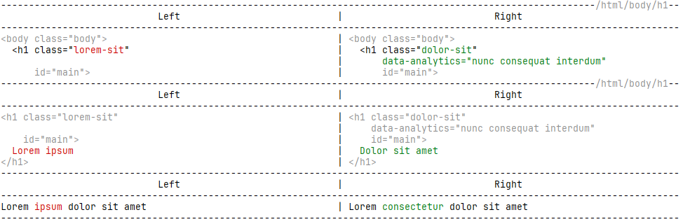
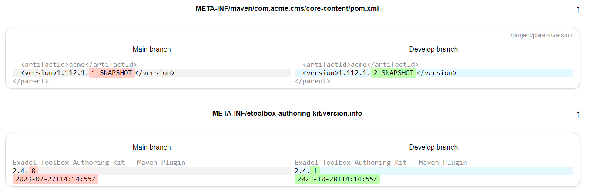

# EToolbox AnyDiff


***

It is a Java library and a command line utility to visually compare content of files and manage differences. Mostly aimed at comparing XML and HTML files but can be used with any textual content.

### Motivation

Compare web pages as rendered by two different versions of server code or hosted in different environments. Compare Adobe Experience Manager (TM) content packages assembled in different builds (from different code branches, etc.). Compare XML output such as Adobe Granite (TM) markup for AEM dialogs; and more.

This tool was originally created to accompany [Exadel Authoring Kit for AEM](https://github.com/exadel-inc/etoolbox-authoring-kit) and perform regression testing. However, it can be used to visualize differences between any two sets of files inside and outside the AEM ecosystem.

### Features

There is the [Java library](./core) available via Maven and a [command-line application](./cli) which is supplied as both a _.jar_ file and an _.exe_ application for Windows. Either offers the same set of features.

Feature display is per the CLI utility with a _.jar_ file.

##### Compare two files, directories
```
java -jar anydiff.jar --left file1.html --right file2.html
```

This will output to the console (and also to a log file) disparities between two files as follows:



You can specify more than one files for both the `--left` and `--right` arguments, space-separated. You can also specify directories or listing files (the ones with the `.lst` or `.list` extensions).

Change the captions for the columns for better clarity with `[...]` syntax
```
java -jar anydiff.jar --left "[Original]/var/log/myapp/" --right "[After update]/var/log/myapp"

```

##### Compare two AEM packages
```
java -jar anydiff.jar --left ./target/ui.content-1.120.1.zip --right ./target/ui.content-1.120.2.zip
```

##### Compare two URLs
```
java -jar anydiff.jar --left http://localhost:4502/content/we-retail/us/en.html?foo=bar --right https://some.aem.instance:4502/content/we-retail/us/en.html?foo=bar&@User-Agent='PostmanRuntime/7.33.0'&@nosslcheck
```
Mind the `@`-prefixed query parameters. This is the way to set custom request headers for the HTTP client. A `@`-prefixed parameter ins converted to an HTTP header and is excluded from the URL being requested.

If the future HTTP header has spaces or other non-URI friendly characters, you should enclose it in single quotes or backticks. Do not use double quotes though.

Apart from projected HTTP headers, you can also set up some additional parameters using the same `@`-syntax.
- `@nosslcheck` tells to trust all SSL certificates. (Can be useful when working in trusted environments that have issues with SSL certificates. However, be cautious using this option when requesting an occasional Internet host);
- `@proxy` is used to specify an HTTP or SOCKS proxy server for the request. E.g., `https://microsoft.com?@proxy='http://localholst:8080'`;
- `@headers` is used to provide a path to a file containing multiple headers for the request, one per line. E.g., `https://microsoft.com?@headers='path/to/headers.txt'`. Note: the easiest way to prepare a file with headers is to visit a browser's Network Inspector and click "Copy as cURL (cmd)" or "Copy as cURL (bash)" on the request that you want to replicate. Then paste the copied command into a text file and remove the headers that you don't need.

##### Log differences to a file

By default, the same output as seen on the screen is logged to a file under `$HOME/.etoolbox-anydiff/logs` (in a text file, `~...~` marks the removal and `+...+` the insertion).

Pass the `--html` argument (or `-h`) to the command line to additionally store an HTML log under `$HOME/.etoolbox-anydiff/html`. Use `--browse` (`-b`) to open the HTML file in the default browser.



##### Modifying comparison output

Use `--width XX` (or `-w XX`) to modify the width of the column in the console and log file. Default is _60_.

Use `--arrange (true|false)` (or `-a (true|false)`) to control comparison of markup files. When set to true, attributes of XML and HTML nodes are arranged alphabetically before comparing. Therefore, no disparity is reported when attributes are in different order. Set it to false if the original order actually matters. Default is _true_.

Use `--normalize (true|false)` (or `-n (true|false)`) to control whether the program re-formats markup files (XML, HTML) before comparison for more accurate and granular results. Default is _true_.

Use `--handle-errorpages (true|false)` (or `-e (true|false)`) to control whether the program should handle error pages (HTTP status 4xx, 5xx) as "normal" pages with comparable markup. Default is _false,_ which means that the error is reported instead of comparing content.

Use `--ignore-spaces` (or `-i`) to make the comparison neglect the number of spaces between words. Default is _false_.
Note: this setting is partially overlapped by `normalize` and `arrange` because preparing perfectly aligned markup trees leads to many empty lines and indentations removed. So, "ignore-spaces" mostly relates to the content of text nodes, and also to non-markup files. Use this option cautiously because it also affects the performance of diffing.

### Java API

The same features are available via the Java API. The usual entry point is the [AnyDiff](./core/src/main/java/com/exadel/etoolbox/anydiff/AnyDiff.java) class which may be used as follows:

```
class Main {
    // ...
    List<Diff> differences = new AnyDiff()
        .left("path/to/file.html")
        .right("/path/to/another/file.html")
        .compare();
    if (AnyDiff.isMatch(differences)) {
       // ...
    }
}
```

To use Java API, add the following dependency to your Maven project:
```
<dependency>
    <groupId>com.exadel.etoolbox</groupId>
    <artifactId>etoolbox-anydiff-core</artifactId>
    <version>1.1.2</version> <!-- always prefer the latest stable version -->
</dependency>
```

#### Features that are available only via Java API

Some features are available only via Java API. They are:
- _preprocessor_ - the ability to specify a routine that will be applied to the content before comparison. This is useful when you need to remove or replace some parts of the content that are not essential or else apply specific formatting (e.g., split into shorter lines);
- _postprocessor_ - the ability to specify a routine that will be applied to the differences after comparison. This is useful when you need to revert the changes introduced by a preprocessor or otherwise reformat the already compared content.

Please see Javadocs in [AnyDiff class](./core/src/main/java/com/exadel/etoolbox/anydiff/AnyDiff.java) for more details.

### Diff filters

One of the powerful features is the ability to eliminate or else "mute" the differences that are not essential or well anticipated. E.g., when comparing live web pages, you will certainly face various timestamps, UUIDs, analytic attributes, etc. which do not actually make web pages different.

These and other differences can be skipped via _filters_ which are applied to the differences before they are reported.

There are two ways to define filters: with Java (for use with Java API) and with JavaScript (for use with the command-line interface).

From the Java API perspective, filters are descendants of the [Filter](./core/src/main/java/com/exadel/etoolbox/anydiff/filter/Filter.java) interface. You can override one or more methods of it.

From the CLI perspective, filters are `.js` files stored in a directory that you specify with the `--filters "/path/to/filters"` argument. Every `.js` file contains one or more user-defined functions (see below).

A filter does one of the two actions:
- _skip_: means that the difference is not reported at all;
- _accept_: means that the difference is "acknowledged." It is reported in the output (to say, for the reference) but is not counted as a real difference == does not affect the result of `isMatch()` call.

A filter can be applied to any of the following entities:
- _diff_: this is the "root" object which usually manifests a pair of whole files or web pages. A diff has its `getLeft()` and `getRight()` methods that return paths to the files of URLs. With _diff_ one can skip a file/page from analysis by their name;
- _block_: this is a sequence of lines that encompass a difference (roughly similar to what we see in a GitHub diff). There are lines with actual differences and lines that are just context. A block has its `getLeft()` and `getRight()` methods that returns left and right text accordingly;
- _line_: this is a single line of text inside a block;
- _fragment pair_: manifests the particular words or symbols within a line that are different for even more granular approach. To expose a fragment pair, a line must have the same number of differences in the left and right part (e.g., a single difference). Also, the first difference must be at the same offset in both parts;
- _fragment_: a single char/symbol sequence within a line that is different from the opposite part. Can be either a part of a fragment pair or a standalone difference.

Java API provides a separate method for every action and entity, like `skipBlock` or `acceptFragment`, etc.

JS API encourages you to define your own functions with the name that matches an action and the argument name that matches an entity. E.g.:
```
function skip(block) {
    return block.getLeft().startsWith("<!--");
}

function accept(fragments) { /* "fragments" == "fragment pair" in meaning */
    return fragments.getLeft().startsWith("lorem") && fragments.getRight().includes("ipsum");
}
```
There can be more than one function in a file. All of them will be applied to the differences.

See examples of filters in the [test resources folder](./core/src/test/resources/filter).

### Troubleshooting

##### My Windows console does not display colored output

This can happen in an older Windows version. See the solution [here](https://ss64.com/nt/syntax-ansi.html).

### Licensing and credits

This software is licensed under the [Apache License, Version 2.0](./LICENSE).

The project makes use of the following open-source libraries:

- [Apache Commons CLI](https://github.com/apache/commons-cli) under the Apache License, Version 2.0;
- [Apache Commons Collections](https://github.com/apache/commons-collections) under the Apache License, Version 2.0;
- [Apache Commons IO](https://github.com/apache/commons-io/) under the Apache License, Version 2.0;
- [Apache Commons Lang](https://github.com/apache/commons-lang/) under the Apache License, Version 2.0;
- [Java Diff Utils](https://github.com/java-diff-utils/java-diff-utils) under the Apache License, Version 2.0;
- [Jsoup: Java HTML Parser](https://github.com/jhy/jsoup) under the [MIT License](https://opensource.org/license/mit/);
- [JUnit](https://github.com/junit-team/junit4) under the [Eclipse Public License Version 1.0](https://www.eclipse.org/legal/epl-v10.html);
- [Logback](https://github.com/qos-ch/logback) under the Eclipse Public License Version 1.0;
- [Mockito](https://github.com/mockito/mockito) under the MIT License;
- [Mozilla Rhino](https://github.com/mozilla/rhino) under the [Mozilla Public License Version 2.0](https://www.mozilla.org/en-US/MPL/2.0/);
- [OkHttp HTTP Client](https://github.com/apache/httpd) under the Apache License, Version 2.0;
- [Project Lombok](https://github.com/projectlombok/lombok) under the [License](https://github.com/projectlombok/lombok/blob/master/LICENSE);
- [SLF4J](https://github.com/qos-ch/slf4j) under the MIT License.
